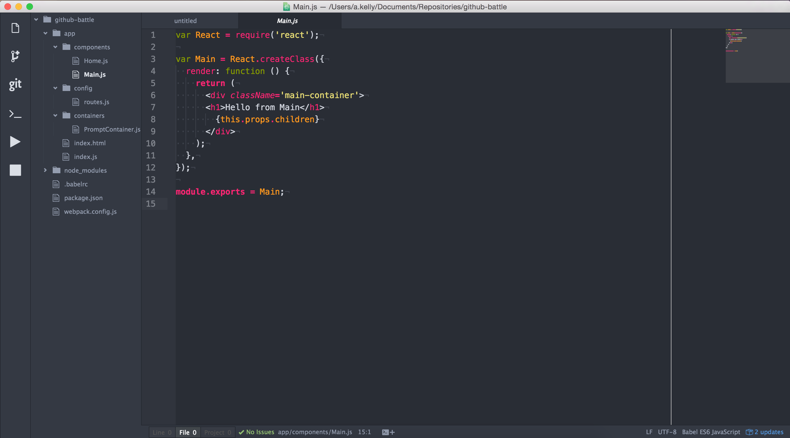

# atom-sync
Backup of my Atom packages and config, which can be shared easily

## Usage
1. To Install this atom IDE ensure that you have Atom installed.
2. Go into your .atom directory and remove all files and folders. 
3. While in .atom directory run 
```
git clone https://github.com/adamk5550/atom-sync.git .
```


## Screenshot


## Themes

- UI - [Genesis](https://atom.io/themes/genesis-ui)
- Syntax - [Atom Monokai](https://atom.io/themes/atom-monokai)


## Packages

- Angularjs
- atom-ternjs
- autoclose-html
- autocomplete-modules
- git-control
- git-blame
- git-history
- git-projects
- highlight-selected
- ionic-framework-snippets
- javascript-snippets
- language-babel
- linter
- linter-eslint
- merge-conflicts
- minimap
- open-in-browser
- react
- react-snippets
- script
- terminal-status
- tool-bar
- tool-bar-config

## Toolbar

- Newfile = Document
- Fork Repo = Search Repos
- Git = Git Control
- Terminal = Terminal
- Gavel = Git Blame

